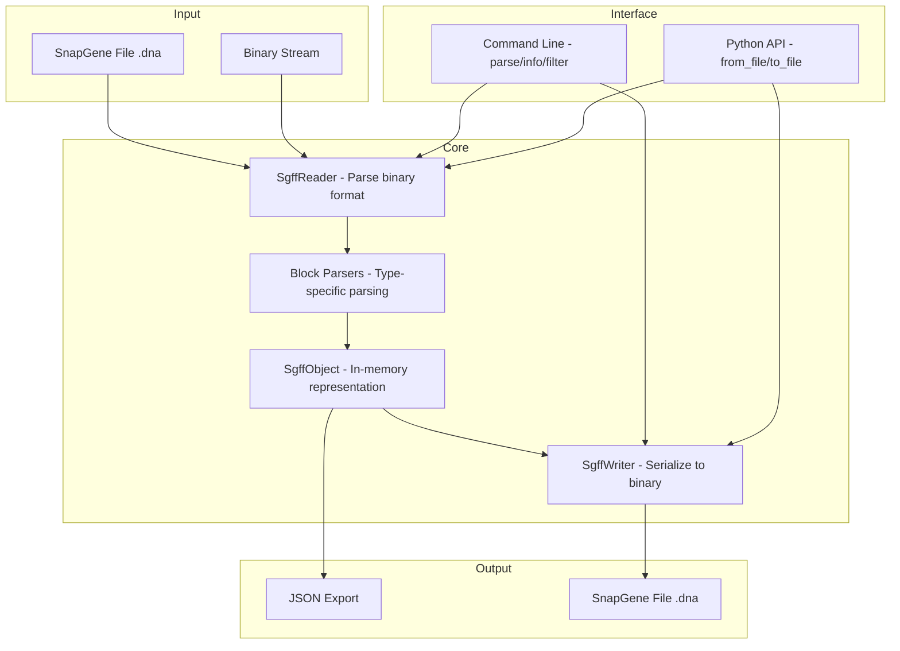

# SnapGene File Format Parser

SnapGene File Format Parser (SGFFP for short) is a reverse-engineered parser for SnapGene DNA, RNA, and protein file formats.

> [!Important]
> Hey! I have tried to decode as many different SnapGene blocks as I can, but surely something must be missing. This is why I ask you to check your SnapGene file(s) with `uv run sff check <your_snapgene_file>` to see which blocks your file has. If you have a new, unknown block type it will notify you with `[NEW] flag` Please open an issue and, if possible, either attach your file or dump the output of the block with the `--examine/-e` flag, i.e. `uv run sff check <your_snapgene_file> -e 1> block.dump`. Let's make parsing SnapGene files better together!

Currently the parser partially does its job, producing a JSON dictionary as the result, as well as a minimalistic writer.

The project aims to be a minimalistic, fast, and useful tool for molecular biologists who happen to get stuck with a large library of SnapGene files that need to be parsed, or for developers who want to create a smooth user experience with SnapGene.

Currently the following scheme is implemented, which is planned to be changed, in a better way:



## Install

Currently this project requires cloning the repository first and do the install.

The project use `uv`, which automatically handles `venv` and packages.

```bash
# to sync project:
uv sync

# to run cli tool:
uv run sff

```


## File Format Overview

SnapGene files use a **Type-Length-Value (TLV)** binary format. Each block consists of:
- 1 byte: block type ID
- 4 bytes: block length (big-endian)
- N bytes: block data

Some blocks contain LZMA-compressed data (types 7, 29, 30) which may themselves contain nested TLV structures. History nodes (type 11) use a complex nested format with compressed DNA sequences encoded at 2 bits per base in `GATC` format.

For detailed file format specifications, see the acknowledgments section.

## Complete Block Type Reference

| ID | Block Type                   | Format           | Decoded |
|----|------------------------------|------------------|---------|
| 0  | DNA Sequence                 | UFT-8            | Yes     |
| 1  | Compressed DNA               | 2-bit encoding   | Yes     |
| 2  | Unknown                      | Unknown          | No      |
| 3  | Enzyme Cutters               | Mixed            | No*      |
| 4  | Unknown                      | Unknown          | No      |
| 5  | Primers                      | XML              | Yes     |
| 6  | Notes                        | XML              | Yes     |
| 7  | History Tree                 | LZMA + XML       | Yes     |
| 8  | Sequence Properties          | XML              | Yes     |
| 9  | File Description (Legacy)    | Unknown          | No      |
| 10 | Features                     | XML              | Yes     |
| 11 | History Nodes                | Nested TLV       | Yes     |
| 12 | Unknown                      | Unknown          | No      |
| 13 | Enzyme Info                  | Binary           | No*      |
| 14 | Custom Enzymes               | XML              | Yes*     |
| 15 | Unknown                      | Unknown          | No      |
| 16 | Sequence Trace (Legacy)      | 4 empty bytes    | No*      |
| 17 | Alignable Sequences          | XML              | Yes     |
| 18 | Sequence Trace               | ZTR format       | Yes     |
| 19 | Uracil Positions             | Unknown          | No      |
| 20 | Custom Colors                | XML              | No      |
| 21 | Protein Sequence             | UTF-8            | Yes     |
| 22 | Unknown                      | Unknown          | No      |
| 23 | Unknown                      | Unknown          | No      |
| 24 | Unknown                      | Unknown          | No      |
| 25 | Unknown                      | Unknown          | No      |
| 26 | Unknown                      | Unknown          | No      |
| 27 | Unknown                      | Unknown          | No      |
| 28 | Enzyme Visualization         | XML              | Yes*     |
| 29 | History Modifier             | LZMA + XML       | Yes     |
| 30 | History Content              | LZMA + Nested    | Yes     |
| 31 | Unknown                      | Unknown          | No      |
| 32 | RNA Sequence                 | UFT-8            | Yes     |


*Marked block types are not decoded, but most likely won't be in the future, as they are internal SnapGene data and should not affect your important data. These block won't be read or written by the parser.

## Supported Block Types

| ID | Block Type                    | Read* | Write* |
|----|-------------------------------|------|-------|
| 0  | DNA Sequence                  | Yes  | Yes    |
| 1  | Compressed DNA                | Yes  | No    |
| 5  | Primers (XML)                 | Yes  | Yes    |
| 6  | Notes (XML)                   | Yes  | Yes    |
| 7  | History Tree (XML)            | Yes  | No    |
| 8  | Sequence Properties (XML)     | Yes  | Yes    |
| 10 | Features (XML)                | Yes  | Yes    |
| 11 | History Nodes                 | Yes  | No    |
| 14 | Custom Enzymes (XML)          | Yes  | Yes    |
| 17 | Alignable Sequences (XML)     | Yes  | Yes    |
| 21 | Protein Sequence              | Yes  | Yes    |
| 28 | Enzyme Visualization (XML)    | Yes  | Yes    |
| 29 | History Modifier (XML)        | Yes  | No    |
| 30 | History Content (Nested)      | Yes  | No    |
| 32 | RNA Sequence                  | Yes  | Yes    |


*Please note current parser does not properly implemented, in it's current form it is useless for end-user, consider waiting for stable 1.0.0 release.


## Roadmap

- [X] Improve SGFF parsing, unify TLV strategy
- [X] Understand whole file structure
- [X] Correctly parse into readable from *almost* every block
- [ ] Parse XML into pure JSON format
- [X] Parse and decode missing blocks and pieces (skipped - YAGNI)
- [X] Create writer
- [ ] Implement minimal working condition for reader and writer
- [ ] Refine, refactor reader/writer
- [ ] Proper documentation and README cleanup

## Acknowledgments

This project would not have been possible without previous work done by
- **Damien Goutte-Gattat**, see his PDF on SGFF structure: https://incenp.org/dvlpt/docs/binary-sequence-formats/binary-sequence-formats.pdf
- **Isaac Luo**, for his version of SnapGene reader: https://github.com/IsaacLuo/SnapGeneFileReader

## License

Distributed under MIT licence, see `LICENSE` for more.
