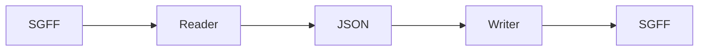

# SnapGene File Format Converter

This is a reversed engineered parser for SnapGene file formats (SGFF in short) - for dna, rna and protein.

Currently parser partially do it's job, the result is a JSON dictionary.

Ideally this project will create a set of writer and reader scripts with the following scheme:



## ImHex pattern parser

The project also has a pattern parser for ImHex: `snapgene.hexpat`, you may use it for examining binary.

## File structure

The file is a Type-Length-Value format, which also partially has compressed blocks (e.g. history node/tree) with LZMA. (see documentation in the acknowledgment section for some insights)

Currently file structure looks like this:

```bash
# file structure table
# 0: sequence_dna:utf-8
# 1: compressed sequence:?
# 2:
# 3:
# 4:
# 5: primers:xml
# 6: notes:xml
# 7: history tree:xml
# 8: additional sequence properties:xml
# 9: file Description:?
# 10: features:xml
# 11: history node:lzma compressed:1.gzip zrt-trace file + 2.xml
# 12:
# 13: legacy?:binary
# 14: enzyme_custom:xml
# 15:
# 16: alignable sequence:binary
# 17: alignable sequence:xml
# 18: sequence trace:?
# 19: uracil Positions:?
# 20: custom colors:xml
# 21: sequence_protein:utf-8
# 22:
# 23:
# 24:
# 25:
# 26:
# 27: unknown:binary
# 28: enzyme_vizualisation:xml
# 29:
# 30:
# 31:
# 32: sequence_rna:utf-8
```

## Install

This project uses `uv`, which automatically handles `venv` and packages.

```bash

# to run scripts do
uv run main.py # or history_analysis.py

```

## Roadmap

- [ ] Understand whole file structure
- [ ] Correctly parse into readable form every block
- [ ] Parse XML into pure JSON format
- [ ] Create writer (if possible)
- [ ] Refine, refactor reader/writer
- [ ] Proper documentation and README cleanup

# Acknowledgments

This project would not have been possible without previous work done by
- Damien Goutte-Gattat, see his PDF on SGFF structure: https://incenp.org/dvlpt/docs/binary-sequence-formats/binary-sequence-formats.pdf
- Isaac Luo, for his version of SnapGene reader: https://github.com/IsaacLuo/SnapGeneFileReader

# License

Distributed under MIT licence, see `LICENSE` for more.
