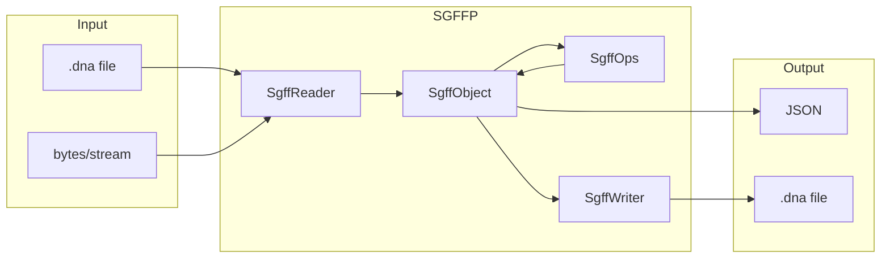

# SnapGene File Format Parser

SnapGene File Format Parser (SGFFP for short) is a reverse-engineered parser for SnapGene DNA, RNA, and protein file formats.

> [!Important]
> Found an unknown block type? Run `sff check your_file.dna -l` and look for `[NEW]` markers. Please report them in [#1](https://github.com/merv1n34k/sgffp/issues/1) with a dump (`sff check your_file.dna -d`). Help us decode more blocks!

The parser reads SnapGene files into Python objects and exports to JSON, with a writer for creating new SnapGene files.

The project aims to be a minimalistic, fast, and useful tool for molecular biologists who need to parse large libraries of SnapGene files, or for developers building SnapGene-compatible applications.

## Architecture


```mermaid
flowchart LR
    subgraph Input
        DNA[".dna file"]
        Bytes["bytes/stream"]
    end

    subgraph SGFFP
        Reader["SgffReader"]
        Object["SgffObject"]
        Ops["SgffOps"]
        Writer["SgffWriter"]
    end

    subgraph Output
        JSON["JSON"]
        File[".dna file"]
    end

    DNA --> Reader
    Bytes --> Reader
    Reader --> Object
    Object --> Ops
    Ops --> Object
    Object --> Writer
    Object --> JSON
    Writer --> File
```

## Installation

```bash
pip install sgffp
```

Or with uv:

```bash
uv add sgffp
```

For development:

```bash
git clone https://github.com/merv1n34k/sgffp.git
cd sgffp
uv sync --all-extras
```

### Quick Start

```python
from sgffp import SgffReader, SgffWriter, SgffObject

# Read a SnapGene file
sgff = SgffReader.from_file("plasmid.dna")

# Access data via typed properties
print(sgff.sequence.value)
print(sgff.features[0].name)

# Modify and write back
sgff.sequence.topology = "circular"
SgffWriter.to_file(sgff, "output.dna")

# Create a new file from scratch
sgff = (
    SgffObject.new("ATGCATGCATGC", topology="circular")
    .add_feature("GFP", "CDS", 0, 8)
    .add_primer("fwd", "ATGC", bind_position=0)
)
SgffWriter.to_file(sgff, "new_plasmid.dna")
```

### History Operations

```python
# Record edits with automatic history tracking
sgff.ops.insert_fragment("ATCGATCG")
sgff.ops.digest("GGCC", InputSummary={"manipulation": "insert"})

# Build an entire history tree from a specification
sgff.ops.build_from_spec(
    [
        {"id": 1, "operation": "ligateFragments", "sequence": "ATCGATCG",
         "name": "Final", "children": [2, 3]},
        {"id": 2, "operation": "makeDna", "sequence": "ATCG"},
        {"id": 3, "operation": "makeDna", "sequence": "ATCG"},
    ],
    final_sequence="ATCGATCG",
)

# Edit existing history nodes in place
sgff.ops.edit_node(node_id=2, name="Renamed", sequence="GGGGCCCC")
```

### CLI Tool

```bash
uv run sff check plasmid.dna    # Inspect file blocks
uv run sff parse plasmid.dna    # Export to JSON
uv run sff info plasmid.dna     # Show file information
uv run sff tree plasmid.dna     # Display edit history timeline
```

## File Format

SnapGene uses a Type-Length-Value (TLV) binary format where each block contains:

| Field  | Size    | Description              |
|--------|---------|--------------------------|
| Type   | 1 byte  | Block type identifier    |
| Length | 4 bytes | Payload size (big-endian)|
| Data   | N bytes | Block payload            |

Data encoding varies by block type: UTF-8 for sequences, XML for annotations, 2-bit encoding for compressed DNA (GATC → 00/01/10/11), and LZMA compression for history blocks.

## Block Types

All known SnapGene block types and their encoding formats:

| ID | Block Type           | Format        | ID | Block Type           | Format        |
|----|----------------------|---------------|----|----------------------|---------------|
| 0  | DNA Sequence         | UTF-8         | 17 | Alignable Sequences  | XML           |
| 1  | Compressed DNA       | 2-bit GATC    | 18 | Sequence Trace       | ZTR           |
| 5  | Primers              | XML           | 20 | Strand Colors        | XML           |
| 6  | Notes                | XML           | 21 | Protein Sequence     | UTF-8         |
| 7  | History Tree         | LZMA + XML    | 28 | Enzyme Visibilities  | XML           |
| 8  | Sequence Properties  | XML           | 29 | History Modifier     | LZMA + XML    |
| 10 | Features             | XML           | 30 | History Content      | LZMA + TLV    |
| 11 | History Nodes        | Binary + TLV  | 32 | RNA Sequence         | UTF-8         |
| 14 | Custom Enzyme Sets   | XML           | 34 | RNA Structure        | LZMA + JSON   |
| 16 | Trace Container      | Binary + TLV  |    |                      |               |

Block 18 (ZTR trace) only appears inside block 16 containers. Blocks 2, 3, 13 (enzyme maps and display settings) are auto-generated by SnapGene and not parsed. For a complete binary format reference, see [SNAPGENE_FORMAT_SPEC.md](SNAPGENE_FORMAT_SPEC.md).

## Supported Block Types

The table below shows which block types can be read from and written to SnapGene files. Blocks marked with a Model have typed Python classes for convenient access (e.g., `sgff.sequence`, `sgff.features`, `sgff.history`).

| ID | Block Type                    | Read | Write | Model |
|----|-------------------------------|------|-------|-------|
| 0  | DNA Sequence                  | +    | +     | +     |
| 1  | Compressed DNA                | +    | +     | +     |
| 5  | Primers (XML)                 | +    | +     | +     |
| 6  | Notes (XML)                   | +    | +     | +     |
| 7  | History Tree (XML)            | +    | +     | +     |
| 8  | Sequence Properties (XML)     | +    | +     | +     |
| 10 | Features (XML)                | +    | +     | +     |
| 11 | History Nodes                 | +    | +     | +     |
| 14 | Custom Enzyme Sets (XML)      | +    | +     |       |
| 16 | Trace Container               | +    | +     | +     |
| 17 | Alignable Sequences (XML)     | +    | +     | +     |
| 18 | ZTR Trace (in block 16)       | +    | +     | +     |
| 20 | Strand Colors (XML)           | +    | +     |       |
| 21 | Protein Sequence              | +    | +     | +     |
| 28 | Enzyme Visibilities (XML)     | +    | +     |       |
| 29 | History Modifier (XML)        | +    | +     | +     |
| 30 | History Content (Nested)      | +    | +     | +     |
| 32 | RNA Sequence                  | +    | +     | +     |
| 34 | RNA Structure (LZMA JSON)     | +    | +     |       |


## Roadmap

- [x] Improve SGFF parsing, unify TLV strategy
- [x] Understand whole file structure
- [x] Correctly parse into readable format from all common blocks
- [x] Create writer for supported block types
- [x] Add comprehensive test suite (380 tests)
- [x] Parse XML into pure JSON format
- [x] Add write support for history blocks (LZMA compression)
- [x] Add typed model classes for easy data access
- [x] De novo file creation with builder pattern
- [x] History operations API (`SgffOps`)
- [ ] Documentation improvements

## Acknowledgments

This project would not have been possible without previous work done by
- **Damien Goutte-Gattat**, see his PDF on SGFF structure: https://incenp.org/dvlpt/docs/binary-sequence-formats/binary-sequence-formats.pdf
- **Isaac Luo**, for his version of SnapGene reader: https://github.com/IsaacLuo/SnapGeneFileReader
- **Kale Kundert**, for autosnapgene, a SnapGene automation tool: https://github.com/kalekundert/autosnapgene

## License

Distributed under MIT licence, see `LICENSE` for more.
